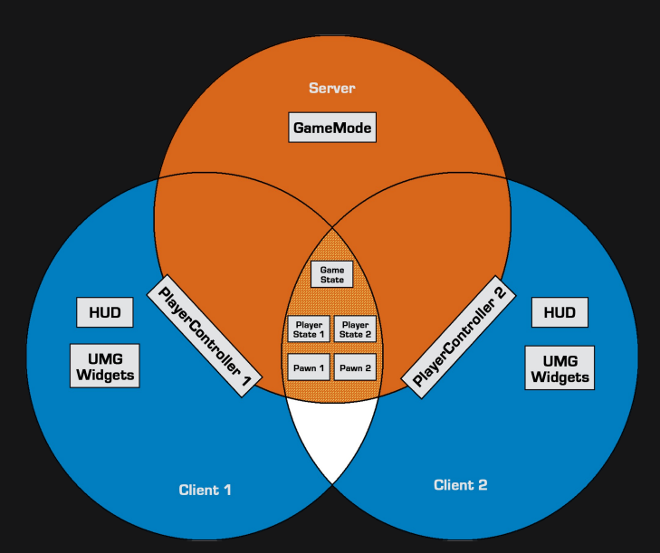

[![MIT License][license-shield]][license-url]
[![LinkedIn][linkedin-shield]][linkedin-url]

<!-- PROJECT LOGO -->

 
 

  
  
  <h3 align="center">MultiplayerFPS</h3>

  

  PROJECT DOCUMENTATION
   

<!-- TABLE OF CONTENTS -->
## Table of Contents

* [Characteristics and purpose of the project](#about-the-project)
  * [Built With](#built-with)
  * [Current Build Status](#current-build-status)  
* [Requirements specification](Requirements)
  * [Functionality](#Functionality)
* [Software system architecture](#Software)
  * [Development Architecture](#Development)
  * [Runtime Architecture](#Runtime)
  * [Side Game Mode Mechanics](#Side-Game-Mode-Mechanics)
* [Tests](#summary)
  * [Tests](#mentions)
  * [Test cases](#contact)
  * [Report on the implementation of test scenarios](#license)
* [Copyright](#Copyright)

<!-- Characteristics and purpose of the project -->
## Characteristics and purpose of the project

*  [  Main characteristics and purpose of the project
is to create software, multiplayer game
that is able to sustain stable connection.]
 
*  [ Handle established gameplay 
within resources of dedicated server
between all connceted players.]

*  [ Design and build clean
 simple, playable level/map
 for the software use.]

 Project template playable with
- Windows desktop computers (tested working version)
- PS4 (after port using dev kit)
- Nintendo Switch (after port using dev kit)
- Android/IOS (Only after high optimization)
which can handle multiplayer match with at least 2 online players.
Builded as a test/template project, used for academic purposes.

### Technology, built with

* [C++]
* [Unreal Engine 4.23.1]
* [Visual Studio 2017]
* [Steam API / conncetion plugins[[PC VERSION]]
* [Free assets]

### Current Build Status
*Map being rebuilded
### Old Build Status
* [13.09.2019 <-- Building main game mechanics    -->19.10.2019]
* [19.10.2019 <-- Building first map   -->26.10.2019]
* [26.10.2019 <-- Fixing server/client bugs   -->30.10.2019]
* [23.11.2019 First playable alpha build deployment]
* [25.11.2019 <-- Fixing Steam Sessions Connection System -->??.11.2019]
* [22.12.2019 <-- Test version]
* [03.05.2020 <-- Map rebuild   -->25.05.2020]

<!-- GETTING STARTED -->
## Functionality

1 . After enabling the application,
the user will see a Mein Menu with fields,
and remain in starting level with menu.
* [MULTIPLAYER]    
* [QUIT]

2.1
MULIPLYAER - Opens new  menu
the user will see a Mein Menu with fields
* [Create Server]    
* [Search Server]
* [back]

3.1
Create Server - Opens new host session menu
the user will see a Host Session Menu with fields
* [ServerName[ USER INPUT]]    
* [Slots] - How much players can join
* [Method] - LAN connection method OR STEAM connection method
* [Mode] - designed mode choice 
* [Map] - designed map choice
* [Back and Create]

3.2
Search server - Opens new search session menu
the user will see a Host Session Menu with fields
and also a name of host if it exists
* [Refresh/Find]
* [Back]

### Development Architecture
  Software backend, was developed
using Unreal Engine 4.23.1 and Visual Studio 2017(C++).
  We used Scrum development aproach
to accomplish all major funcionalities.
  Map was designed in Blender
then rebuilded in unreal.
  For networking plugin we used
steam advanced sesssions.

*Network Development Architecture diagram *

### Scrennshots

*New Map is going to be builded and designed

### Installation
 
* blank for now/ testing *

<!-- USAGE EXAMPLES -->
## Main Game Mode Mechanics

### Movement
Use W/A/S/D to control character movement.
Use Shift to Sprint.
Use C to crouch.

### Hip-fire
Hip-firing is not accurate and precise to encourage players to use more ADS system.
When moving, recoil system mix shots far away from the center.
A more stable position equals better aim when firing.

### ADS
When you aim down sight you have got 100% accurate shot.
What's the catch?
While aiming you can't move.
So you got to change your position and take shots quickly to win.

<!-- Tests -->
### Tests
Tests and report on the implementation of test scenarios.

Testing  LAN funcionality
Environment: Windows based desktop PC, Windows based laptop,One WIFI area
Application components tested:

-Lan Component Funcionality
-Stability of connceted devices
-UI 

Result: Both PC's connected running stable 

Testing  STEAM funcionality
Environment: Windows based desktop PC, Windows based laptop,both on using diffrent Wifi
Application components tested:

-Steam Component Funcionality
-Stability of connceted devices
-UI 

Result: Both PC's connected running stable 

<!-- ROADMAP -->
## Side Game Mode Mechanics

### Hitmark System
* [Deathmatch]headshot-[100]hp
* [Deathmatch]upper body-[65-75]hp
* [Deathmatch]torso-[50-60]hp
* [Deathmatch]arms/legs-[25-30]hp
* [Deathmatch]foot/fingers-[10-15]hp

<!-- Summary -->
## Sumary

* [Map rebuild, testing]

<!-- LICENSE -->
## Copyright

The application was created by students of the University of Gdańsk in the field of IT and econometrics with a specialization in IT applications in business. The authors are Paweł Brzóska and Maciej Adamczak. The software license is fully open - MIT (Massachusetts Institute of Technology) from the FSF (Free Software Fundation) group.

## Mentions
*Michał Tessar - GAME TESTER -
*Maciej Choromański - GAME TESTER - https://github.com/MaciejChoromanski

## Team
*Paweł Brzóska - Programming/Testing
*Maciej Adamczak - Game Design/Level Designer/

<!-- MARKDOWN LINKS & IMAGES -->
<!-- https://www.markdownguide.org/basic-syntax/#reference-style-links -->
[issues-url]: https://github.com/othneildrew/Best-README-Template/issues
[license-shield]: https://img.shields.io/github/license/othneildrew/Best-README-Template.svg?style=flat-square
[license-url]: https://github.com/othneildrew/Best-README-Template/blob/master/LICENSE.txt
[linkedin-shield]: https://img.shields.io/badge/-LinkedIn-black.svg?style=flat-square&logo=linkedin&colorB=555
[linkedin-url]: https://www.linkedin.com/in/paweł-brzóska-522634179/
[product-screenshot]: images/screenshot.png
